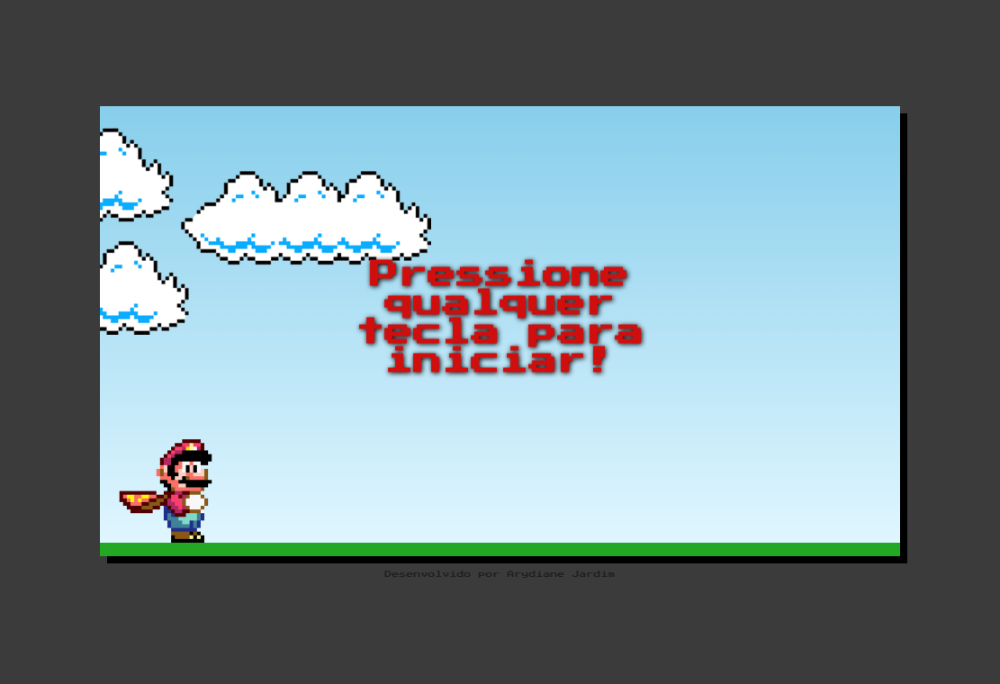
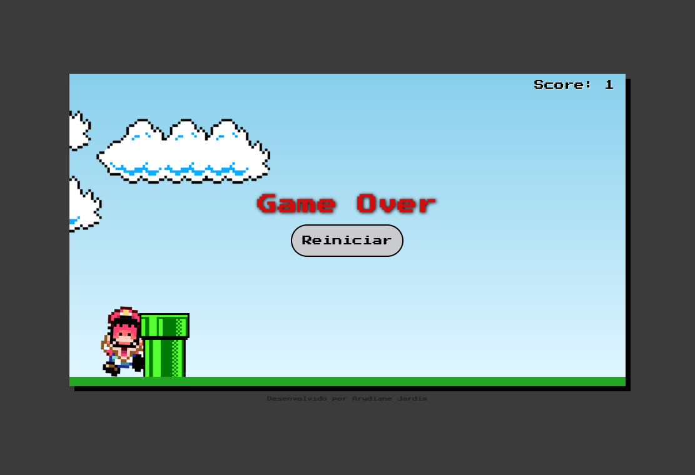

# Projeto Jogo Mario Jump
O projeto Jogo Mario Jump tem como objetivo principal permitir que o jogador realize saltos sobre tubulações, 
buscando atingir o maior número possível de saltos bem-sucedidos. O jogo chega ao fim quando o personagem 
colide com uma tubulação, resultando em sua morte. Para realizar um salto, o jogador simplesmente precisa pressionar qualquer tecla.

O jogo foi desenvolvido inspirado no [tutorial ManualDEV](https://youtu.be/r9buAwVBDhA), mas foram implementadas diversas
modificações para enriquecer a experiência:
- Adição de efeitos sonoros para as telas de abertura e encerramento
- Implementação de um comando para iniciar o jogo
- Integração de uma tela de "game over"
- Inclusão da exibição do placar (score) para acompanhar o desempenho
- Adição de um botão para reiniciar o jogo
  
## 💻 Layout  

  
  

    
## 🔧 Tecnologias

O projeto foi desenvolvido utilizando as seguintes tecnologias:
- HTML
- CSS
- Javascript

## 🛠️ Como Executar o Projeto

Para jogar, basta clicar aqui e desfrutar da experiência!
Divirta-se!
